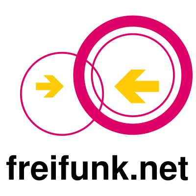
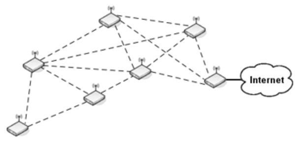
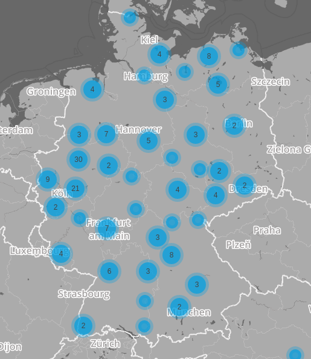

#

# How to set up your own Freifunk router
## André Gaul, [@andrenarchy](https://twitter.com/andrenarchy), Freifunk Berlin

---

# What is Freifunk

 * free and non-commercial network where everyone can participate
 * *free* as in freedom
 * DIY-extension of the internet
 * a mesh network
 * wifi routers (primarily)
 * operated and owned by individuals
 * accessible to everyone (commons!)
 * communities all over Germany: Hamburg, Leipzig, Berlin, Rheinland, Franken,
   Augsburg, München, ...
 * [freifunk.net](http://freifunk.net)
 * [@freifunk](http://twitter.com/freifunk)

---

# Basic idea: mesh networks

---

# Freifunk community map

---

# How to participate @ Freifunk

 * use the network for day-to-day internet access
 * extend the Freifunk network by setting up your own wifi router
 * provide content: websites, owncloud, chat, phone, radio/video streaming,
   minecraft, ...
 * spread the idea of Freifunk

---

# Freifunk Hamburg

<iframe src="https://map.hamburg.freifunk.net" width="100%" height="600"></iframe>

---

# Freifunk Berlin

<iframe src="http://openwifimap.net/map.html#bbox=52.44471056482437,13.151321411132812,52.586989210232005,13.597984313964844" width="100%" height="600"></iframe>

---

# Pics or it didn't happen
## Freifunk @ Rathaus Kreuzberg

---

# Pics or it didn't happen
## Freifunk @ Rathaus Kreuzberg

---

# Network + wifi basics in 10 minutes

---

# Wifi

 * electro-magnetic wave: light, radio, satellites, mobile phones, wifi,
   bluetooth, ...
 * currently 2 frequency bands for wifi:
    * 2.4GHz (channels 1-13)
    * 5GHz (channels 36-140)
 * two important wifi modes:
    * adhoc (all participants can communicate directly if in range)
    * access point with clients (AP coordinates everything)
 * for applications, wifi looks like a cable network (*ethernet*)
 * but: wifi often has severe packet loss due to bad signals!

---

# Antennas

 * Antennas differ
    * Dipole (see your home router)
    * Dish
    * Panel
    * ...

---

# Data transmission

 * data is transmitted in packets/frames between devices
 * packets/frames have a source and a destination address
 * OSI model layers:
    1. physical layer: wifi, twisted pair, fiber, ...
    2. data link layer: usually local area, exchange of *frames*,
       MAC addresses (ethernet), *example MAC address: 0e:d9:63:1a:a5:83*
    3. network layer: internet, exchange of *packets*, IP-addresses,
       routing between subnets, *example IP address: 10.230.42.42*
    4. ...

---

# Routing protocols @ Freifunk

 * get to know your neighbors!
 * 2 major routing protocols are used
    * **batman advanced**
        * layer 2
        * deals with MAC-addresses
        * a batman network works like a huge LAN
    * **OLSR**
        * layer 3
        * deals with IP-addresses
        * an OLSR network works like the internet at its core

---

# Let's set up some routers!

 * steps:
    1. get a router
    2. get the Freifunk firmware for your router and community
    3. flash the Freifunk firmware on your router
    4. configure your router
    5. ???
    6. profit!
 * steps 2 and 4 depend on the community
 * where do you want to use your router?
